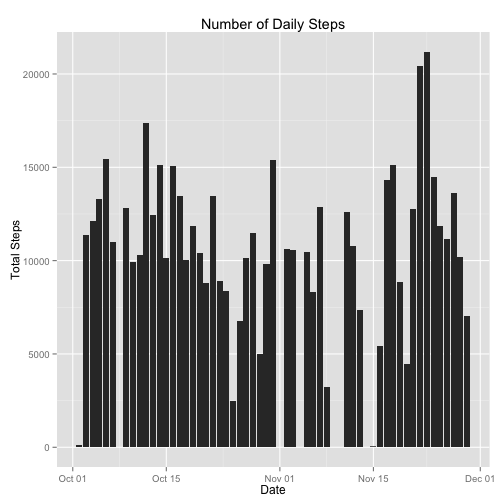
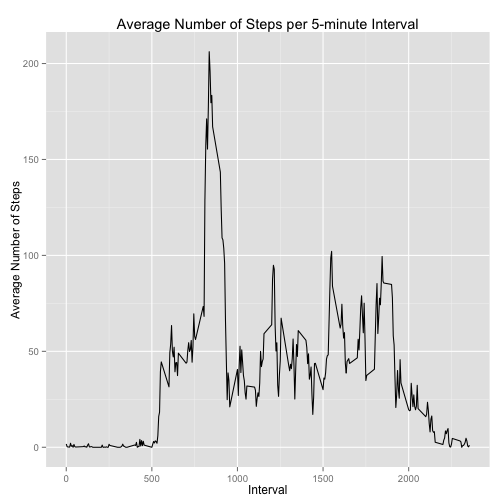
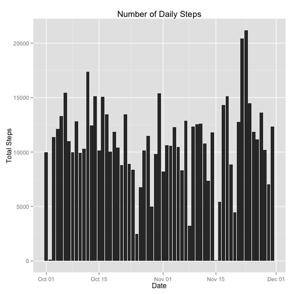
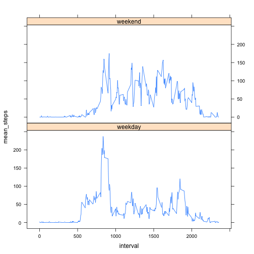

## Loading and preprocessing the data


Here we read the `activity.csv` file (from within `activity.zip`) with `stringsAsFactors = FALSE` so that the date values are not converted to factors and we can easily convert them to time values.


```r
library(dplyr)
library(lubridate)

tdf <-
  read.csv(unz("activity.zip", "activity.csv"), stringsAsFactors = FALSE) %>%
  mutate(date = ymd(date)) %>%
  tbl_df()
```

## What is mean total number of steps taken per day?

*Calculate the total number of steps taken per day*

Filter out the rows with missing `steps` values, group by `date`, and compute the total number of steps per day (date).


```r
steps_by_date <-
  tdf %>%
  filter(!is.na(steps)) %>%
  group_by(date) %>%
  summarize(total_steps = sum(steps))
```

*Make a histogram of the total number of steps taken each day*


```r
library(ggplot2)

qplot(steps_by_date$date,
      steps_by_date$total_steps,
      geom = "histogram",
      stat = "identity",
      main = "Number of Daily Steps",
      xlab = "Date",
      ylab = "Total Steps")
```

 

*Calculate and report the mean and median of the total number of steps taken per day*


```r
mean_daily_total_steps <- mean(steps_by_date$total_steps)
median_daily_total_steps <- median(steps_by_date$total_steps)
```

> The **mean** number of steps taken per day is 10766.19 and the **median** number of steps taken per day is 10765.

## What is the average daily activity pattern?

*Make a time series plot (i.e. type = "l") of the 5-minute interval (x-axis) and the average number of steps taken, averaged across all days (y-axis).*


```r
mean_steps_by_interval <-
  tdf %>%
  group_by(interval) %>%
  summarize(mean_steps = mean(steps, na.rm = TRUE))
```


```r
qplot(mean_steps_by_interval$interval,
      mean_steps_by_interval$mean_steps,
      geom = "line",
      main = "Average Number of Steps per 5-minute Interval",
      xlab = "Interval",
      ylab = "Average Number of Steps")
```

 

*Which 5-minute interval, on average across all the days in the dataset, contains the maximum number of steps?*


```r
max_mean_steps <- max(mean_steps_by_interval$mean_steps)
max_mean_interval <-
  mean_steps_by_interval[
    mean_steps_by_interval$mean_steps == max_mean_steps,]$interval
```

> Interval 835 contains the maximum number of steps with 206.17 steps on average.

## Imputing missing values

*Calculate and report the total number of missing values in the dataset (i.e. the total number of rows with NAs)*


```r
num_missing_values <- sum(is.na(tdf$steps))
```

> There are 2304 missing values.

*Devise a strategy for filling in all of the missing values in the dataset. The strategy does not need to be sophisticated. For example, you could use the mean/median for that day, or the mean for that 5-minute interval, etc.*

We'll compute the mean number of steps taken for each interval for each weekday and use these values to replace the missing values. That is, for each missing value of `steps`, we'll replace the missing value with the average number of steps taken for the weekday and interval for that row.


```r
mean_steps_by_weekday_interval <-
  tdf %>%
  filter(!is.na(steps)) %>%
  mutate(weekday = weekdays(date)) %>%
  group_by(weekday, interval) %>%
  summarize(mean_steps = mean(steps, na.rm = TRUE))
```

*Create a new dataset that is equal to the original dataset but with the missing data filled in.*

First, we'll create a function that expects a row of data containing a date and an interval and returns the average number of steps for the date's weekday and the interval, by using `mean_steps_by_weekday_interval` as a lookup table.


```r
interpolate_steps <- function(x) {
  weekday <- weekdays(ymd(x["date"]))
  interval <- as.integer(x["interval"])
  mean_steps_by_weekday_interval[
    mean_steps_by_weekday_interval$weekday == weekday &
      mean_steps_by_weekday_interval$interval == interval,]$mean_steps
}
```

Now we'll create the new data set by applying the function above to the rows with missing `steps` values.


```r
filled_tdf <- tdf
filled_tdf[is.na(tdf$steps), "steps"] <-
  apply(tdf[is.na(tdf$steps),], 1, interpolate_steps)
```

*Make a histogram of the total number of steps taken each day*


```r
filled_steps_by_date <-
  filled_tdf %>%
  group_by(date) %>%
  summarize(steps = sum(steps))

qplot(filled_steps_by_date$date,
      filled_steps_by_date$steps,
      geom = "histogram",
      stat = "identity",
      main = "Number of Daily Steps",
      xlab = "Date",
      ylab = "Total Steps")
```

 

*Calculate and report the mean and median total number of steps taken per day.*


```r
mean_filled_steps <- mean(filled_steps_by_date$steps)
median_filled_steps <- median(filled_steps_by_date$steps)
```

> The **mean** number of steps taken per day is 10821.21 and the **median** number of steps taken per day is 11015.

*Do these values differ from the estimates from the first part of the assignment? What is the impact of imputing missing data on the estimates of the total daily number of steps?*

> Yes, these values differ from the previously computed values. Imputing the missing data causes both values to increase.

## Are there differences in activity patterns between weekdays and weekends?

*For this part the weekdays() function may be of some help here. Use the dataset with the filled-in missing values for this part.*

*Create a new factor variable in the dataset with two levels – "weekday" and "weekend" indicating whether a given date is a weekday or weekend day.*


```r
filled_tdf$daytype <-
  as.factor(
    ifelse(
      weekdays(filled_tdf$date) %in% c("Saturday", "Sunday"),
      "weekend",
      "weekday")
  )
```

*Make a panel plot containing a time series plot (i.e. type = "l") of the 5-minute interval (x-axis) and the average number of steps taken, averaged across all weekday days or weekend days (y-axis). See the README file in the GitHub repository to see an example of what this plot should look like using simulated data.*


```r
library(lattice)

mean_filled_steps_by_interval_daytype <-
  filled_tdf %>%
  group_by(interval, daytype) %>%
  summarize(mean_steps = mean(steps))

with(mean_filled_steps_by_interval_daytype,
  xyplot(mean_steps ~ interval | daytype, type = "l", layout = c(1, 2)))
```

 
